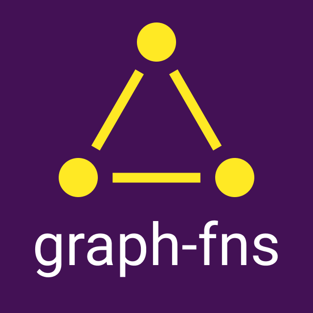
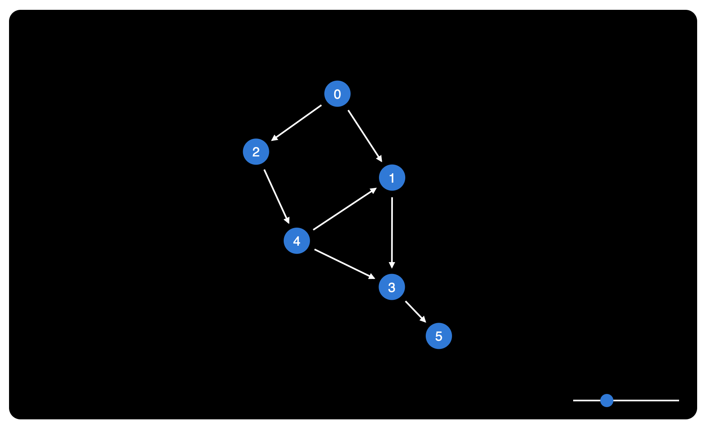

<div align="center">
  <h1>
    
  </h1>
  <p>A utility library for working with graphs.</p>
  <p>
    
    
  </p>
</div>

## Features

- Flow and TypeScript declarations included.
- CommonJS, UMD and ESM modules provided.
- Zero dependencies.
- D3.js interoperability.

## Demo

https://h2788.csb.app/



## Installation

Yarn:

```shell
yarn add graph-fns
```

NPM:

```shell
npm install graph-fns
```

## Usage

```js
import { create, addEdge, isCyclic, topologicalSort } from "graph-fns";

let graphA = create(3, (i) => String.fromCharCode(65 + i));
//=> [Graph] { A, B, C }

graphA = addEdge(graphA, ["A", "C"]);
//=> [Graph] { A -> C, B }

graphA = addEdge(graphA, ["B", "A"]);
//=> [Graph] { B -> A -> C }

isCyclic(graphA);
//=> false

topologicalSort(graphA);
//=> ["B", "A", "C"]

let graphB = create(3, (i) => String.fromCharCode(65 + i));
//=> [Graph] { A, B, C }

graphB = addEdge(graphB, ["A", "B"]);
//=> [Graph] { A -> B, C }

graphB = addEdge(graphB, ["B", "C"]);
//=> [Graph] { A -> B -> C }

graphB = addEdge(graphB, ["C", "A"]);
//=> [Graph] { A -> B -> C -> A }

isCyclic(graphB);
//=> true
```

## Terminology

| Term | Synonym(s) | Description |
| --- | --- | --- |
| graph | network | A system of vertices connected in pairs by edges. ([Wikipedia](<https://en.wikipedia.org/wiki/Graph_(discrete_mathematics)>)) |
| vertex | node | The fundamental unit of which graphs are formed. ([Wikipedia](<https://en.wikipedia.org/wiki/Vertex_(graph_theory)>)) |
| edge | link | A connection between two vertices in a graph. ([Wikipedia](<https://en.wikipedia.org/wiki/Edge_(graph_theory)>)) |

## Types

### Graph

```ts
declare type Graph = {
  [u: string]: {
    [v: string]: number;
  };
};
```

An [adjacency matrix](https://en.wikipedia.org/wiki/Adjacency_matrix) that describes the edges between each vertex. A value of `0` indicates there is no edge between the two vertices and a value of `1` indicates there is an edge connecting them (directed from `u` to `v`).

### D3Graph

```ts
declare type D3Graph = {
  nodes: Array<{
    id: string;
  }>;
  links: Array<{
    source: string;
    target: string;
  }>;
};
```

This representation of a graph is convinient for using with [D3.js force-directed graphs](https://github.com/d3/d3-force).

## API

### addEdge

```ts
declare const addEdge: (graph: Graph, edge: [string, string]) => Graph;
```

Adds a new edge to the graph. The order of the vertices in the edge determine the direction of the edge — the edge will start at the first vertex and end at the second (`[start, end]`).

### addVertex

```ts
declare const addVertex: (graph: Graph, vertex: string) => Graph;
```

Adds a new vertex to the graph. The new vertex will not have any edges connecting it to existing vertices in the graph.

### children

```ts
declare const children: (graph: Graph, vertex: string) => Set<string>;
```

Returns all the vertices that are children of the given vertex — there is an edge starting at the given vertex going to the child vertex. If there is an edge that both starts and ends at the given vertex, it will be considered a child of itself and included in the result.

### clone

```ts
declare const clone: (graph: Graph) => Graph;
```

Creates a copy of the graph.

### create

```ts
declare const create: (size?: number, id?: (i: number) => string) => Graph;
```

Creates a new graph. The new graph can be seeded with an optional number of vertices, but it will not contain any edges.

The `size` argument defines how many vertices with which to seed the graph. Additional vertices can be added using [addVertex](#addVertex), but it is more effecient to create them upfront when possible.

The `id` function can be provided to specify how to generate ID's for each of the seed vertices. The `i` argument passed is the "index" of the vertex being created — a unique positive integer starting at 0, incrementing by 1 for each vertex. The default function will simply convert `i` to a string (`(i) => i.toString(10)`) resulting in ID's like: `"0"`, `"1"`, `"2"` etc.

### descendants

```ts
declare const descendants: (graph: Graph, vertex: string) => Set<string>;
```

Given a [DAG](https://en.wikipedia.org/wiki/Directed_acyclic_graph), recursively finds all the vertices under the given vertex.

Note: If the given graph contains cycles (checked with `isCyclic`), an error will be thrown.

### edges

```ts
declare const edges: (graph: Graph) => Array<[string, string]>;
```

Returns an array of the edges in the graph.

### fromD3

```ts
declare const fromD3: (graph: D3Graph) => Graph;
```

Converts a graph from a [D3Graph](#d3graph) representation into a [Graph](#graph) representation.

**Note**: Any data associated with nodes or links in the D3Graph representation will be discarded.

### indegrees

```ts
declare const indegrees: (graph: Graph) => { [id: string]: number };
```

Returns the graph's vertices mapped to their [indegree](https://en.wikipedia.org/wiki/Indegree) (the number of edges ending at the vertex).

### isCyclic

```ts
declare const isCyclic: (graph: Graph) => boolean;
```

Returns `true` if the graph provided contains any [cycles](<https://en.wikipedia.org/wiki/Cycle_(graph_theory)>) (including "loops" — when an edge that starts and ends at the same vertex), otherwise returns `false`.

### order

```ts
declare const order: (graph: Graph) => number;
```

Returns the number of vertices in the graph.

### outdegrees

```ts
declare const outdegrees: (graph: Graph) => { [id: string]: number };
```

Returns the graph's vertices mapped to their [outdegree](https://en.wikipedia.org/wiki/Outdegree) (the number of edges starting at the vertex).

### removeEdge

```ts
declare const removeEdge: (graph: Graph, edge: [string, string]) => Graph;
```

Removes an edge from a graph.

### removeVertex

```ts
declare const removeVertex: (graph: Graph, vertex: string) => Graph;
```

Removes a vertex from a graph.

### size

```ts
declare const size: (graph: Graph) => number;
```

Returns the number of edges in the graph.

### toD3

```ts
declare const toD3: (graph: Graph) => D3Graph;
```

Converts a graph from a [Graph](#graph) representation into a [D3Graph](#d3graph) representation.

### topologicalSort

```ts
declare const topologicalSort: (graph: Graph) => Array<string>;
```

Given a [DAG](https://en.wikipedia.org/wiki/Directed_acyclic_graph), returns an array of the graph's vertices sorted using a [topological sort](https://en.wikipedia.org/wiki/Topological_sorting).

### transpose

```ts
declare const transpose: (graph: Graph) => Graph;
```

Flips the orientation of all edges in a directed graph.

```js
let graph = create(3, (i) => String.fromCharCode(65 + i));
//=> [Graph] { A, B, C }

graph = addEdge(graph, ["A", "B"]);
//=> [Graph] { A -> B, C }

graph = addEdge(graph, ["B", "C"]);
//=> [Graph] { A -> B -> C }

graph = transpose(graph);
//=> [Graph] { A <- B <- C }
```

### vertices

```ts
declare const vertices: (graph: Graph) => Array<string>;
```

Returns an array of the vertices in the graph.

## Roadmap

1. Interactive demo.
2. Graphics in the README to better explain the concepts for anyone not familiar with graph theory.
3. Submodules so functions can be imported individually.
4. Support for undirected graphs.
5. Weights for edges & nodes.
6. Pathfinding algorithms.
7. Functional programming friendly variations of the functions (argument order reversed to support currying).
